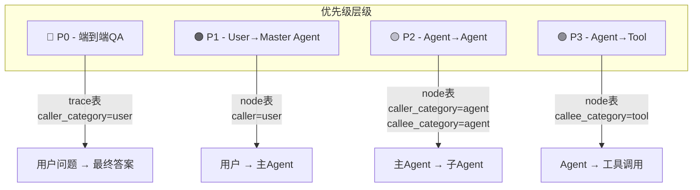
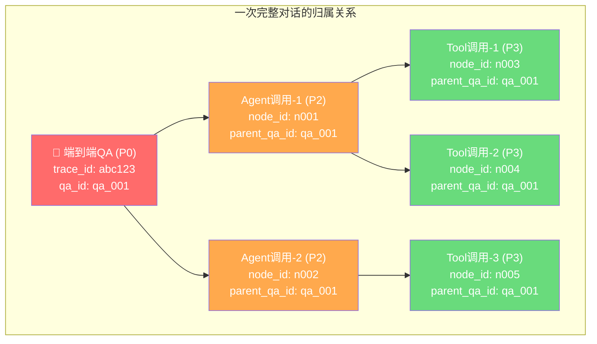
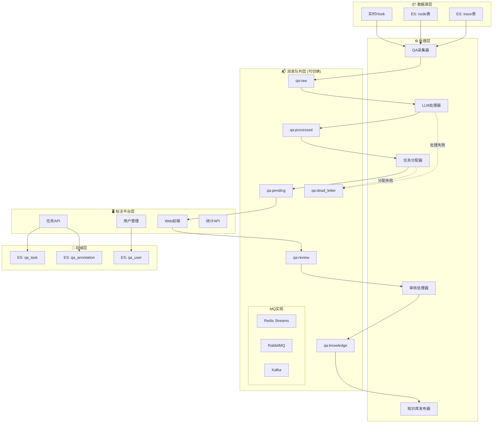
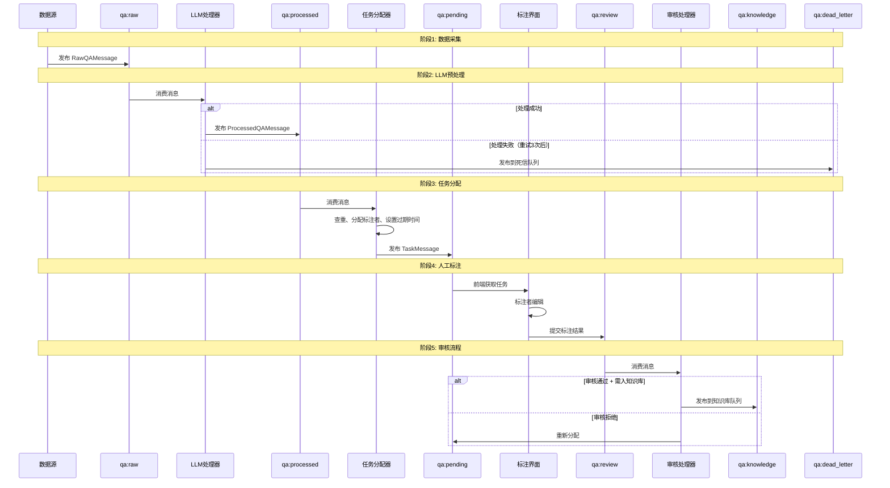
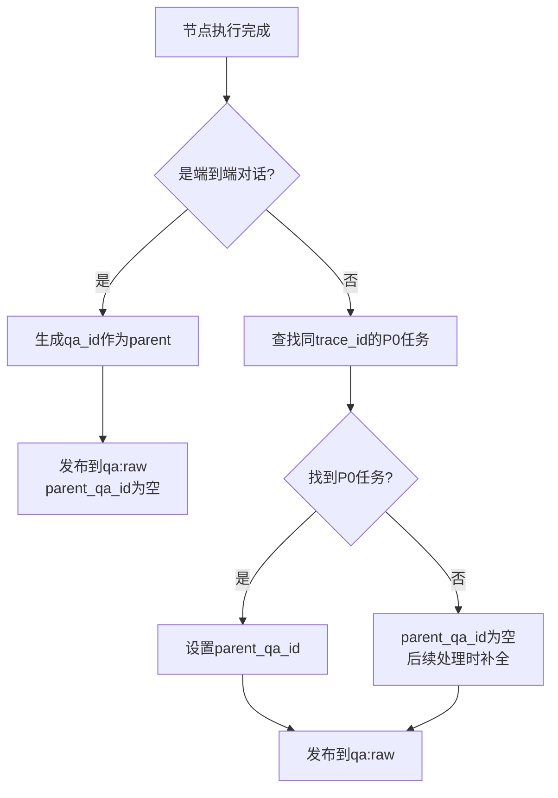
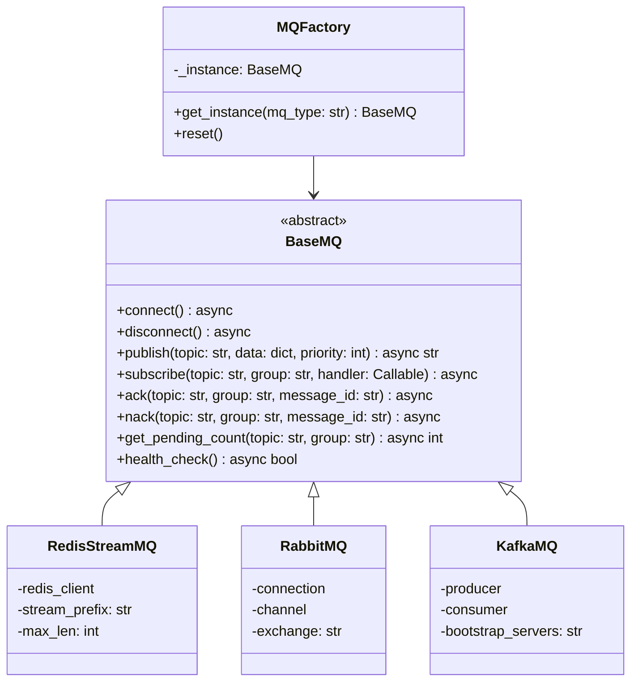
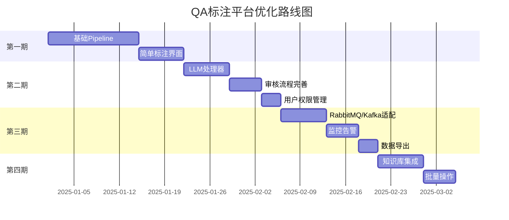

# -*- encoding: utf-8 -*-
"""
@author: chenda14
@time: 2025-12-25
@email: chenda14@jd.com
@desc: OxyGent QA标注平台架构设计方案
"""

# OxyGent QA标注平台架构设计方案 v2.1

## 📋 一、需求分析与数据源确认

### 1.1 核心目标

构建一套基于消息队列的QA数据标注Pipeline，从OxyGent框架的对话记录中提取高质量训练语料。

### 1.2 数据源确认

通过对实际ES数据的分析，确认各表的存储内容和用途：

| 表名 | 写入时机 | 主要内容 | 适用场景 |
|------|---------|---------|---------|
| **`{app}_trace`** | `caller_category == "user"` | 端到端完整对话（input + output） | **P0优先级：端到端QA** |
| **`{app}_node`** | 每个节点执行时 | 所有节点的调用记录（caller/callee/input/output） | **P1/P2/P3：Agent间QA** |
| **`{app}_history`** | `is_save_history=True` | QA精简记录（session_name + memory） | 辅助数据源 |
| **`{app}_message`** | `is_stored=True` | 前端消息流 | 暂不采集 |

### 1.3 数据源字段详解

#### trace表（端到端对话）

```json
{
  "trace_id": "xxx",           // 会话ID（关键：用于关联子节点）
  "group_id": "xxx",           // 多轮对话组ID
  "request_id": "xxx",         // 请求ID
  "callee": "master_agent",    // 被调用的Agent
  "input": "{\"query\": \"...\", \"full_memory\": [...]}",  // 完整输入
  "output": "最终回答内容",     // 最终输出
  "shared_data": "{}",         // 共享数据
  "create_time": "2025-..."    // 创建时间
}
```

#### node表（Agent间调用）

```json
{
  "node_id": "xxx",            // 节点ID
  "trace_id": "xxx",           // 关联的会话ID（关键：建立归属关系）
  "caller": "master_agent",    // 调用者
  "callee": "time_agent",      // 被调用者
  "call_stack": ["user", "master_agent", "time_agent"],  // 调用链
  "father_node_id": "xxx",     // 父节点ID（关键：建立层级关系）
  "input": "{...}",            // 输入参数
  "output": "执行结果",         // 输出结果
  "state": 3,                  // 状态（3=COMPLETED）
  "node_type": "agent",        // 节点类型（agent/tool/llm）
  "create_time": "2025-..."
}
```

### 1.4 QA优先级定义



**优先级判断规则说明：**

| 优先级 | 条件 | 数据源 | 场景描述 |
|--------|------|--------|----------|
| P0 | `caller_category == "user"` 且在 trace 表 | trace表 | 用户发起的完整对话，包含最终答案 |
| P1 | `caller == "user"` 且在 node 表 | node表 | 用户直接调用某个Agent的记录 |
| P2 | `caller_category == "agent"` 且 `callee_category == "agent"` | node表 | Agent之间的调用 |
| P3 | `callee_category == "tool"` 或 `node_type == "tool"` | node表 | Agent调用工具的记录 |

### 1.5 归属关系设计

**核心概念：一个端到端对话（P0）会触发多个子调用（P1-P3），它们通过 `trace_id` 建立归属关系。**



**归属关系建立规则：**

1. **从 trace 表导入时**：
   - 先创建端到端QA（P0），生成 `qa_id`
   - 再查询该 `trace_id` 下的所有 node 记录
   - 将这些 node 的 `parent_qa_id` 设置为端到端QA的 `qa_id`

2. **从 node 表单独导入时**：
   - 如果该 `trace_id` 对应的端到端QA已存在，关联到该 `parent_qa_id`
   - 如果不存在，`parent_qa_id` 为空

3. **实时Hook采集时**：
   - 每个节点完成时立即采集
   - 通过 `trace_id` 在后续LLM处理阶段建立关联

---

## 🏗️ 二、整体架构设计

### 2.1 系统架构图



---

## 📬 三、消息队列Topic设计与Pipeline流转

### 3.1 Topic定义

| Topic名称 | 描述 | 生产者 | 消费者 | 消息格式 |
|-----------|------|--------|--------|----------|
| `qa:raw` | 原始QA数据 | Hook采集器 / 历史导入器 | LLM处理器 | RawQAMessage |
| `qa:processed` | LLM处理后的数据 | LLM处理器 | 任务分配器 | ProcessedQAMessage |
| `qa:pending` | 待标注任务 | 任务分配器 | 前端轮询 / WebSocket | TaskMessage |
| `qa:review` | 待审核任务 | 标注提交 | 审核处理器 | ReviewMessage |
| `qa:knowledge` | 待入知识库 | 审核处理器 | 知识库发布器 | KnowledgeMessage |
| `qa:dead_letter` | 处理失败的消息 | 各处理器 | 运维监控 | ErrorMessage |

### 3.2 Pipeline流转详解



### 3.3 各阶段消息格式定义

#### RawQAMessage（原始QA消息）

```python
@dataclass
class RawQAMessage:
    """原始QA数据消息"""
    qa_id: str                    # QA唯一标识
    batch_id: str                 # 批次ID（导入时生成）
    
    # QA内容
    question: str                 # 问题
    answer: str                   # 答案
    qa_hash: str                  # QA内容的MD5（用于去重）
    
    # 来源追溯
    source_type: str              # e2e/user_agent/agent_agent/agent_tool
    source_trace_id: str          # 原始trace_id
    source_node_id: str           # 原始node_id（可选）
    source_group_id: str          # 原始group_id
    
    # 调用信息
    caller: str                   # 调用者
    callee: str                   # 被调用者
    call_chain: List[str]         # 完整调用链
    
    # 归属关系
    parent_qa_id: str             # 父QA的ID（端到端QA的ID）
    
    # 优先级
    priority: int                 # 0-3，数值越小优先级越高
    
    # 时间
    created_at: str               # 创建时间
```

#### ProcessedQAMessage（处理后的QA消息）

```python
@dataclass
class ProcessedQAMessage(RawQAMessage):
    """LLM处理后的QA消息"""
    # 继承RawQAMessage的所有字段
    
    # LLM处理结果
    llm_summary: str              # LLM生成的摘要
    llm_quality_score: float      # 质量评分 0.0-1.0
    llm_suggested_category: str   # 建议的分类
    llm_is_valid: bool            # 是否为有效QA
    llm_issues: List[str]         # 发现的问题列表
    
    # 处理状态
    processed_at: str             # 处理时间
    retry_count: int              # 重试次数
```

#### TaskMessage（任务消息）

```python
@dataclass
class TaskMessage:
    """标注任务消息"""
    task_id: str                  # 任务ID
    qa_id: str                    # 关联的QA ID
    
    # 任务内容（复制自ProcessedQAMessage）
    question: str
    answer: str
    llm_summary: str
    llm_quality_score: float
    
    # 归属关系
    parent_task_id: str           # 父任务ID（对应端到端QA）
    source_trace_id: str
    
    # 分配信息
    assigned_to: str              # 分配给谁
    assigned_at: str              # 分配时间
    expire_at: str                # 过期时间
    
    # 状态
    status: str                   # pending/assigned/annotated
    priority: int
```

### 3.4 Pipeline流转规则

#### 3.4.1 LLM处理器规则

**输入**：`qa:raw` 中的 `RawQAMessage`

**处理逻辑**：
1. **去重检查**：根据 `qa_hash` 检查是否已存在
2. **LLM分析**：调用配置的LLM模型进行质量评估
3. **归属关系补全**：根据 `source_trace_id` 查找并关联 `parent_qa_id`

**输出规则**：
- 处理成功：发布到 `qa:processed`
- 重复数据：丢弃，记录日志
- 处理失败：重试3次后发布到 `qa:dead_letter`

**可选配置**：
```json
{
  "llm_processor": {
    "enabled": true,           // 是否启用LLM处理
    "skip_if_disabled": true,  // 禁用时直接转发到下一阶段
    "model": "default_llm",
    "max_retries": 3,
    "retry_delay_seconds": 5
  }
}
```

#### 3.4.2 任务分配器规则

**输入**：`qa:processed` 中的 `ProcessedQAMessage`

**处理逻辑**：
1. **质量过滤**：`llm_quality_score < 0.3` 的任务标记为低质量
2. **优先级排序**：按 `priority` 排序
3. **标注者选择**：根据以下规则选择：
   - 优先分配给擅长该类别的标注者
   - 考虑当前工作量均衡
   - 考虑标注者的历史质量
4. **设置过期时间**：默认24小时

**输出规则**：
- 分配成功：发布到 `qa:pending`，同时写入 `qa_task` 表
- 无可用标注者：延迟重试

#### 3.4.3 审核处理器规则

**输入**：`qa:review` 中的 `ReviewMessage`

**处理逻辑**：
1. 读取审核结果
2. 更新任务状态

**输出规则**：
- 审核通过 + 需入知识库：发布到 `qa:knowledge`
- 审核通过 + 不需入库：直接归档
- 审核拒绝：发布到 `qa:pending` 重新分配

---

## 🎯 四、优先级与归属关系详细设计

### 4.1 优先级计算逻辑

```python
def calculate_priority(oxy_request: OxyRequest) -> int:
    """
    计算QA对的优先级
    
    优先级规则：
    - P0 (0): 端到端对话，用户发起且有完整回答
    - P1 (1): 用户直接调用Agent
    - P2 (2): Agent调用Agent
    - P3 (3): Agent调用Tool
    
    返回值越小，优先级越高
    """
    caller_category = oxy_request.caller_category
    callee_category = oxy_request.callee_category
    caller = oxy_request.caller
    
    # P0: 用户发起的调用，且被调用者是Agent
    if caller_category == "user" and callee_category == "agent":
        # 判断是否是is_master的agent（主agent）
        if len(oxy_request.call_stack) == 2:  # ["user", "master_agent"]
            return 0  # 端到端
        return 1  # 用户直接调用子Agent
    
    # P1: 用户调用（非Agent情况）
    if caller == "user":
        return 1
    
    # P2: Agent调用Agent
    if caller_category == "agent" and callee_category == "agent":
        return 2
    
    # P3: 调用Tool或其他
    return 3
```

### 4.2 归属关系建立机制

#### 4.2.1 实时Hook采集时



**实时Hook无法直接知道parent_qa_id的问题解决方案：**

由于实时Hook是在每个节点完成时触发，此时可能：
1. 端到端任务尚未完成（子任务先完成）
2. 无法知道最终的parent_qa_id

**解决方案：延迟关联**

```python
class QACollectorHook:
    async def on_node_completed(self, oxy_request, oxy_response):
        qa_data = self._build_qa_data(oxy_request, oxy_response)
        
        # 如果是端到端对话，记录trace_id与qa_id的映射
        if qa_data["source_type"] == "e2e":
            await self._cache_trace_mapping(
                trace_id=qa_data["source_trace_id"],
                qa_id=qa_data["qa_id"]
            )
            qa_data["parent_qa_id"] = ""  # 端到端任务本身没有parent
        else:
            # 尝试从缓存获取parent_qa_id
            parent_qa_id = await self._get_cached_parent(qa_data["source_trace_id"])
            qa_data["parent_qa_id"] = parent_qa_id or ""
        
        await self.mq.publish("raw", qa_data)
    
    async def _cache_trace_mapping(self, trace_id: str, qa_id: str):
        """缓存trace_id到qa_id的映射，用于建立归属关系"""
        cache_key = f"qa:trace_parent:{trace_id}"
        await self.redis.setex(cache_key, 3600, qa_id)  # 1小时过期
    
    async def _get_cached_parent(self, trace_id: str) -> str:
        """获取缓存的parent_qa_id"""
        cache_key = f"qa:trace_parent:{trace_id}"
        return await self.redis.get(cache_key) or ""
```

#### 4.2.2 批量导入时

批量导入时可以直接建立完整的归属关系：

```python
async def import_from_trace(self, ...):
    """从trace表导入端到端QA"""
    for trace in traces:
        # 1. 创建端到端QA
        e2e_qa = self._trace_to_qa(trace, batch_id)
        e2e_qa["parent_qa_id"] = ""  # 端到端任务没有parent
        await self.mq.publish("raw", e2e_qa, priority=0)
        
        # 2. 导入关联的子节点
        if include_sub_nodes:
            nodes = await self._query_nodes_by_trace(trace["trace_id"])
            for node in nodes:
                sub_qa = self._node_to_qa(node, batch_id)
                sub_qa["parent_qa_id"] = e2e_qa["qa_id"]  # 设置归属关系
                await self.mq.publish("raw", sub_qa, priority=sub_qa["priority"])
```

### 4.3 归属关系在前端的展示

```
┌──────────────────────────────────────────────────────────────────────────┐
│  任务列表                                                                │
├──────────────────────────────────────────────────────────────────────────┤
│                                                                          │
│  ▼ 🔴P0 现在几点了？请保存到time.txt                [E2E] [待标注]       │
│    │                                                                     │
│    ├── 🟡P2 time_agent: 获取当前时间              [Agent] [待标注]      │
│    │   └── 🟢P3 get_current_time: 查询时区时间    [Tool]  [已完成]      │
│    │                                                                     │
│    └── 🟡P2 file_agent: 保存文件                  [Agent] [待标注]      │
│        └── 🟢P3 write_file: 写入time.txt          [Tool]  [已完成]      │
│                                                                          │
│  ▶ 🔴P0 帮我查询订单状态                          [E2E]   [进行中]      │
│                                                                          │
└──────────────────────────────────────────────────────────────────────────┘
```

---

## 🔧 五、配置项设计

### 5.1 完整配置项

```json
{
  "default": {
    "qa_annotation": {
      "enabled": false,
      "realtime_hook_enabled": false,
      
      "mq": {
        "type": "redis",
        "redis": {
          "stream_prefix": "qa",
          "consumer_group": "qa_processor",
          "max_len": 100000,
          "block_timeout_ms": 5000
        },
        "rabbitmq": {
          "host": "localhost",
          "port": 5672,
          "username": "guest",
          "password": "guest",
          "vhost": "/",
          "exchange": "qa_exchange",
          "prefetch_count": 10
        },
        "kafka": {
          "bootstrap_servers": "localhost:9092",
          "group_id": "qa_processor",
          "auto_offset_reset": "earliest"
        }
      },
      
      "collector": {
        "exclude_callees": ["retrieve_tools", "default_llm"],
        "exclude_callee_types": ["llm"],
        "min_question_length": 2,
        "min_answer_length": 10,
        "max_answer_length": 50000,
        "dedup_enabled": true,
        "dedup_cache_ttl_seconds": 86400
      },
      
      "llm_processor": {
        "enabled": true,
        "skip_if_disabled": true,
        "model": "default_llm",
        "batch_size": 10,
        "max_retries": 3,
        "retry_delay_seconds": 5,
        "quality_threshold": 0.3
      },
      
      "task": {
        "expire_hours": 24,
        "max_retry_count": 3,
        "priority_weights": {
          "e2e": 0,
          "user_agent": 1,
          "agent_agent": 2,
          "agent_tool": 3
        },
        "auto_assign": true,
        "assignment_strategy": "round_robin"
      },
      
      "review": {
        "enabled": true,
        "auto_approve_threshold": 0.9,
        "require_review_for_kb": true
      },
      
      "platform": {
        "page_size": 20,
        "enable_kb_export": true,
        "export_formats": ["json", "jsonl", "csv"]
      }
    }
  }
}
```

### 5.2 Config类扩展

```python
# oxygent/config.py 新增方法

class Config:
    # ... 现有代码 ...
    
    """ qa_annotation """
    
    @classmethod
    def get_qa_annotation_config(cls) -> dict:
        return cls._config.get("qa_annotation", {})
    
    @classmethod
    def is_qa_annotation_enabled(cls) -> bool:
        return cls.get_qa_annotation_config().get("enabled", False)
    
    @classmethod
    def is_qa_realtime_hook_enabled(cls) -> bool:
        if not cls.is_qa_annotation_enabled():
            return False
        return cls.get_qa_annotation_config().get("realtime_hook_enabled", False)
    
    @classmethod
    def get_qa_mq_config(cls) -> dict:
        return cls.get_qa_annotation_config().get("mq", {})
    
    @classmethod
    def get_qa_mq_type(cls) -> str:
        return cls.get_qa_mq_config().get("type", "redis")
    
    @classmethod
    def get_qa_collector_config(cls) -> dict:
        return cls.get_qa_annotation_config().get("collector", {})
    
    @classmethod
    def get_qa_llm_processor_config(cls) -> dict:
        return cls.get_qa_annotation_config().get("llm_processor", {})
    
    @classmethod
    def is_qa_llm_processor_enabled(cls) -> bool:
        return cls.get_qa_llm_processor_config().get("enabled", True)
    
    @classmethod
    def get_qa_task_config(cls) -> dict:
        return cls.get_qa_annotation_config().get("task", {})
    
    @classmethod
    def get_qa_review_config(cls) -> dict:
        return cls.get_qa_annotation_config().get("review", {})
```

---

## 📬 六、消息队列抽象设计

### 6.1 MQ抽象基类



### 6.2 MQ基类完整定义

```python
# oxygent/qa_annotation/mq/base_mq.py

from abc import ABC, abstractmethod
from typing import Callable, Any, Optional, List
from dataclasses import dataclass
import logging

logger = logging.getLogger(__name__)


@dataclass
class MQMessage:
    """MQ消息封装"""
    message_id: str
    topic: str
    data: dict
    priority: int = 0
    retry_count: int = 0
    created_at: str = ""


class BaseMQ(ABC):
    """消息队列抽象基类，支持多种MQ实现"""
    
    @abstractmethod
    async def connect(self) -> None:
        """建立连接"""
        pass
    
    @abstractmethod
    async def disconnect(self) -> None:
        """断开连接"""
        pass
    
    @abstractmethod
    async def publish(
        self,
        topic: str,
        data: dict,
        priority: int = 0,
        delay_seconds: int = 0
    ) -> str:
        """
        发布消息
        
        Args:
            topic: 主题名称（不含前缀）
            data: 消息数据
            priority: 优先级（0最高）
            delay_seconds: 延迟发送秒数（用于重试）
            
        Returns:
            消息ID
        """
        pass
    
    @abstractmethod
    async def subscribe(
        self,
        topic: str,
        group: str,
        handler: Callable[[MQMessage], Any],
        batch_size: int = 10,
    ) -> None:
        """
        订阅消息（Consumer Group模式）
        
        Args:
            topic: 主题名称
            group: 消费者组名称
            handler: 消息处理函数，接收MQMessage，返回处理结果
            batch_size: 批量处理数量
        """
        pass
    
    @abstractmethod
    async def ack(self, topic: str, group: str, message_id: str) -> None:
        """确认消息已成功处理"""
        pass
    
    @abstractmethod
    async def nack(
        self,
        topic: str,
        group: str,
        message_id: str,
        requeue: bool = True
    ) -> None:
        """
        消息处理失败
        
        Args:
            topic: 主题
            group: 消费者组
            message_id: 消息ID
            requeue: 是否重新入队
        """
        pass
    
    @abstractmethod
    async def get_pending_count(self, topic: str, group: str) -> int:
        """获取待处理消息数量"""
        pass
    
    @abstractmethod
    async def get_dead_letter_count(self) -> int:
        """获取死信队列消息数量"""
        pass
    
    async def health_check(self) -> bool:
        """健康检查"""
        try:
            await self.get_pending_count("_health_check", "test")
            return True
        except Exception as e:
            logger.warning(f"MQ health check failed: {e}")
            return False
    
    async def publish_to_dead_letter(
        self,
        original_topic: str,
        data: dict,
        error: str
    ) -> str:
        """发布到死信队列"""
        dead_letter_data = {
            "original_topic": original_topic,
            "original_data": data,
            "error": error,
            "failed_at": get_format_time(),
        }
        return await self.publish("dead_letter", dead_letter_data)
```

### 6.3 MQ工厂类

```python
# oxygent/mq_factory.py

from typing import Optional
from oxygent.config import Config
import logging

logger = logging.getLogger(__name__)


class MQFactory:
    """
    消息队列工厂类（单例模式）
    
    使用示例:
        mq = MQFactory().get_instance()
        await mq.publish("raw", {"question": "...", "answer": "..."})
    """
    
    _instance: Optional["MQFactory"] = None
    _mq_client = None
    _initialized = False
    
    def __new__(cls, *args, **kwargs):
        if not hasattr(cls, "_factory_instance"):
            cls._factory_instance = super().__new__(cls)
        return cls._factory_instance
    
    async def get_instance(self, mq_type: str = None, **kwargs):
        """
        获取MQ实例（异步初始化）
        
        Args:
            mq_type: MQ类型（redis/rabbitmq/kafka），默认从配置读取
            **kwargs: MQ配置参数，会覆盖配置文件中的值
            
        Returns:
            BaseMQ实例
        """
        if self._mq_client is not None and self._initialized:
            return self._mq_client
        
        if mq_type is None:
            mq_type = Config.get_qa_mq_type()
        
        mq_config = Config.get_qa_mq_config().get(mq_type, {}).copy()
        mq_config.update(kwargs)
        
        if mq_type == "redis":
            from oxygent.qa_annotation.mq.redis_stream_mq import RedisStreamMQ
            self._mq_client = RedisStreamMQ(**mq_config)
        elif mq_type == "rabbitmq":
            from oxygent.qa_annotation.mq.rabbitmq import RabbitMQ
            self._mq_client = RabbitMQ(**mq_config)
        elif mq_type == "kafka":
            from oxygent.qa_annotation.mq.kafka_mq import KafkaMQ
            self._mq_client = KafkaMQ(**mq_config)
        else:
            raise ValueError(f"Unsupported MQ type: {mq_type}")
        
        # 建立连接
        await self._mq_client.connect()
        self._initialized = True
        
        logger.info(f"Initialized MQ client: {mq_type}")
        return self._mq_client
    
    def get_instance_sync(self) -> Optional["BaseMQ"]:
        """同步获取已初始化的实例（用于非异步上下文）"""
        if not self._initialized:
            return None
        return self._mq_client
    
    async def close(self):
        """关闭MQ连接"""
        if self._mq_client and self._initialized:
            await self._mq_client.disconnect()
            self._initialized = False
    
    def reset(self):
        """重置MQ实例（用于测试）"""
        self._mq_client = None
        self._initialized = False
```

---

## 📊 七、数据采集模块设计

### 7.1 实时Hook集成

**注入位置**：在 `base_agent.py` 的 `_post_save_data` 方法中：

```python
# oxygent/oxy/agents/base_agent.py

async def _post_save_data(self, oxy_response: OxyResponse):
    """Save complete trace and history data after processing."""
    await super()._post_save_data(oxy_response)
    oxy_request = oxy_response.oxy_request
    
    # ... 现有的trace和history保存逻辑 ...
    
    # QA标注平台Hook - 在ES保存完成后触发
    if Config.is_qa_realtime_hook_enabled():
        try:
            await self._publish_qa_to_mq(oxy_request, oxy_response)
        except Exception as e:
            # Hook失败不应影响主流程
            logger.warning(f"QA annotation hook failed: {e}")

async def _publish_qa_to_mq(self, oxy_request: OxyRequest, oxy_response: OxyResponse):
    """发布QA数据到消息队列"""
    from oxygent.qa_annotation.collectors.hook_collector import QACollectorHook
    
    hook = await QACollectorHook.get_instance()
    await hook.on_node_completed(oxy_request, oxy_response)
```

### 7.2 采集器完整实现

```python
# oxygent/qa_annotation/collectors/hook_collector.py

from typing import Optional
from oxygent.config import Config
from oxygent.mq_factory import MQFactory
from oxygent.schemas import OxyRequest, OxyResponse, OxyState
from oxygent.utils.common_utils import generate_uuid, get_format_time, get_md5
import logging

logger = logging.getLogger(__name__)


class QACollectorHook:
    """
    QA数据实时采集Hook
    
    在每个Agent节点执行完成后触发，将QA数据发布到消息队列。
    通过配置可控制是否启用，以及过滤规则。
    """
    
    _instance: Optional["QACollectorHook"] = None
    
    @classmethod
    async def get_instance(cls) -> "QACollectorHook":
        if cls._instance is None:
            cls._instance = cls()
            await cls._instance._init()
        return cls._instance
    
    def __init__(self):
        self.config = Config.get_qa_collector_config()
        self.mq = None
        self.redis = None  # 用于缓存trace映射
    
    async def _init(self):
        """异步初始化"""
        self.mq = await MQFactory().get_instance()
        # 获取Redis用于缓存（复用现有连接）
        from oxygent.db_factory import DBFactory
        # 这里需要根据实际情况获取Redis客户端
    
    async def on_node_completed(
        self,
        oxy_request: OxyRequest,
        oxy_response: OxyResponse
    ):
        """
        节点执行完成时触发
        
        Args:
            oxy_request: 执行请求
            oxy_response: 执行响应
        """
        # 1. 检查是否需要采集
        if not self._should_collect(oxy_request, oxy_response):
            return
        
        # 2. 构建QA数据
        qa_data = self._build_qa_data(oxy_request, oxy_response)
        
        # 3. 处理归属关系
        await self._handle_parent_relationship(qa_data)
        
        # 4. 发布到消息队列
        try:
            message_id = await self.mq.publish(
                topic="raw",
                data=qa_data,
                priority=qa_data["priority"]
            )
            logger.debug(f"Published QA to MQ: {message_id}, qa_id={qa_data['qa_id']}")
        except Exception as e:
            logger.error(f"Failed to publish QA: {e}")
            raise
    
    def _should_collect(
        self,
        oxy_request: OxyRequest,
        oxy_response: OxyResponse
    ) -> bool:
        """判断是否需要采集该QA对"""
        
        # 1. 状态必须是成功
        if oxy_response.state != OxyState.COMPLETED:
            return False
        
        # 2. 排除指定的callee
        exclude_callees = self.config.get("exclude_callees", [])
        if oxy_request.callee in exclude_callees:
            return False
        
        # 3. 排除指定类型
        exclude_types = self.config.get("exclude_callee_types", [])
        if oxy_request.callee_category in exclude_types:
            return False
        
        # 4. 必须有有效的query
        question = oxy_request.arguments.get("query", "")
        min_q_len = self.config.get("min_question_length", 2)
        if len(question) < min_q_len:
            return False
        
        # 5. 答案长度检查
        answer = str(oxy_response.output)
        min_a_len = self.config.get("min_answer_length", 10)
        max_a_len = self.config.get("max_answer_length", 50000)
        if len(answer) < min_a_len or len(answer) > max_a_len:
            return False
        
        return True
    
    def _build_qa_data(
        self,
        oxy_request: OxyRequest,
        oxy_response: OxyResponse
    ) -> dict:
        """构建QA数据结构"""
        
        question = oxy_request.arguments.get("query", "")
        answer = str(oxy_response.output)
        qa_hash = get_md5(f"{question}:{answer}")
        
        priority = self._calculate_priority(oxy_request)
        source_type = self._get_source_type(oxy_request)
        
        return {
            # 标识
            "qa_id": generate_uuid(),
            "batch_id": "",  # 实时采集没有batch_id
            
            # QA内容
            "question": question,
            "answer": answer,
            "qa_hash": qa_hash,
            
            # 来源追溯
            "source_type": source_type,
            "source_node_id": oxy_request.node_id,
            "source_trace_id": oxy_request.current_trace_id,
            "source_group_id": oxy_request.group_id,
            
            # 调用信息
            "caller": oxy_request.caller,
            "callee": oxy_request.callee,
            "caller_category": oxy_request.caller_category,
            "callee_category": oxy_request.callee_category,
            "call_chain": oxy_request.call_stack,
            
            # 归属关系（后续处理）
            "parent_qa_id": "",
            
            # 优先级
            "priority": priority,
            
            # 时间
            "created_at": get_format_time(),
        }
    
    def _calculate_priority(self, oxy_request: OxyRequest) -> int:
        """
        计算优先级
        
        P0: 端到端（用户→主Agent，call_stack长度为2）
        P1: 用户直接调用子Agent
        P2: Agent→Agent
        P3: Agent→Tool
        """
        weights = Config.get_qa_task_config().get("priority_weights", {
            "e2e": 0, "user_agent": 1, "agent_agent": 2, "agent_tool": 3
        })
        
        caller_category = oxy_request.caller_category
        callee_category = oxy_request.callee_category
        call_stack_len = len(oxy_request.call_stack)
        
        # 用户发起的调用
        if caller_category == "user":
            if callee_category == "agent" and call_stack_len == 2:
                return weights.get("e2e", 0)  # P0
            return weights.get("user_agent", 1)  # P1
        
        # Agent调用Agent
        if caller_category == "agent" and callee_category == "agent":
            return weights.get("agent_agent", 2)  # P2
        
        # Agent调用Tool
        return weights.get("agent_tool", 3)  # P3
    
    def _get_source_type(self, oxy_request: OxyRequest) -> str:
        """获取数据源类型标识"""
        caller_category = oxy_request.caller_category
        callee_category = oxy_request.callee_category
        call_stack_len = len(oxy_request.call_stack)
        
        if caller_category == "user":
            if callee_category == "agent" and call_stack_len == 2:
                return "e2e"
            return "user_agent"
        elif callee_category == "agent":
            return "agent_agent"
        return "agent_tool"
    
    async def _handle_parent_relationship(self, qa_data: dict):
        """
        处理归属关系
        
        1. 如果是端到端QA，缓存trace_id → qa_id的映射
        2. 如果是子QA，尝试从缓存获取parent_qa_id
        """
        trace_id = qa_data["source_trace_id"]
        
        if qa_data["source_type"] == "e2e":
            # 缓存映射关系
            cache_key = f"qa:trace_parent:{trace_id}"
            cache_ttl = self.config.get("dedup_cache_ttl_seconds", 86400)
            
            if self.redis:
                await self.redis.setex(cache_key, cache_ttl, qa_data["qa_id"])
            
            qa_data["parent_qa_id"] = ""  # 端到端本身没有parent
        else:
            # 尝试获取parent
            cache_key = f"qa:trace_parent:{trace_id}"
            
            if self.redis:
                parent_qa_id = await self.redis.get(cache_key)
                qa_data["parent_qa_id"] = parent_qa_id.decode() if parent_qa_id else ""
            else:
                qa_data["parent_qa_id"] = ""
```

### 7.3 历史数据导入器

```python
# oxygent/qa_annotation/collectors/history_importer.py

from typing import List, Optional, Dict, Any
from datetime import datetime
from oxygent.config import Config
from oxygent.mq_factory import MQFactory
from oxygent.utils.common_utils import generate_uuid, get_format_time, get_md5
import json
import logging

logger = logging.getLogger(__name__)


class QAHistoryImporter:
    """
    从ES历史数据批量导入QA
    
    支持从trace表和node表导入数据，用户可在标注平台界面上操作。
    """
    
    def __init__(self, es_client, mq_client=None):
        self.es_client = es_client
        self.mq = mq_client
        self.app_name = Config.get_app_name()
        self.collector_config = Config.get_qa_collector_config()
    
    async def _ensure_mq(self):
        """确保MQ客户端已初始化"""
        if self.mq is None:
            self.mq = await MQFactory().get_instance()
    
    async def preview_import(
        self,
        start_time: str,
        end_time: str,
        include_trace: bool = True,
        include_node_agent: bool = True,
        include_node_tool: bool = False,
    ) -> Dict[str, int]:
        """
        预览导入数据量
        
        Returns:
            各数据源的数量统计
        """
        stats = {
            "trace_count": 0,
            "node_agent_count": 0,
            "node_tool_count": 0,
            "estimated_total": 0,
        }
        
        time_range = {"range": {"create_time": {"gte": start_time, "lte": end_time}}}
        
        if include_trace:
            trace_query = {"query": time_range, "size": 0}
            result = await self.es_client.search(f"{self.app_name}_trace", trace_query)
            stats["trace_count"] = result.get("hits", {}).get("total", {}).get("value", 0)
        
        if include_node_agent or include_node_tool:
            # 查询agent类型节点
            if include_node_agent:
                agent_query = {
                    "query": {
                        "bool": {
                            "must": [
                                time_range["range"],
                                {"term": {"node_type": "agent"}},
                                {"term": {"state": 3}}
                            ]
                        }
                    },
                    "size": 0
                }
                result = await self.es_client.search(f"{self.app_name}_node", agent_query)
                stats["node_agent_count"] = result.get("hits", {}).get("total", {}).get("value", 0)
            
            # 查询tool类型节点
            if include_node_tool:
                tool_query = {
                    "query": {
                        "bool": {
                            "must": [
                                time_range["range"],
                                {"term": {"node_type": "tool"}},
                                {"term": {"state": 3}}
                            ]
                        }
                    },
                    "size": 0
                }
                result = await self.es_client.search(f"{self.app_name}_node", tool_query)
                stats["node_tool_count"] = result.get("hits", {}).get("total", {}).get("value", 0)
        
        stats["estimated_total"] = (
            stats["trace_count"] +
            stats["node_agent_count"] +
            stats["node_tool_count"]
        )
        
        return stats
    
    async def import_data(
        self,
        start_time: str,
        end_time: str,
        include_trace: bool = True,
        include_node_agent: bool = True,
        include_node_tool: bool = False,
        include_sub_nodes: bool = True,
        limit: int = 1000,
    ) -> Dict[str, Any]:
        """
        执行导入
        
        Args:
            start_time: 开始时间 (YYYY-MM-DD HH:mm:ss)
            end_time: 结束时间
            include_trace: 是否导入trace表
            include_node_agent: 是否导入agent类型node
            include_node_tool: 是否导入tool类型node
            include_sub_nodes: 导入trace时是否同时导入关联的子节点
            limit: 最大导入数量
            
        Returns:
            导入结果统计
        """
        await self._ensure_mq()
        
        batch_id = generate_uuid()
        stats = {
            "batch_id": batch_id,
            "trace_imported": 0,
            "node_imported": 0,
            "skipped": 0,
            "errors": 0,
            "started_at": get_format_time(),
        }
        
        # 用于记录已处理的trace，避免重复导入子节点
        processed_traces = set()
        # 用于记录trace_id到qa_id的映射
        trace_qa_mapping = {}
        
        try:
            # 1. 导入trace表数据
            if include_trace:
                trace_result = await self._import_traces(
                    start_time, end_time, batch_id, limit,
                    include_sub_nodes, trace_qa_mapping, processed_traces
                )
                stats["trace_imported"] = trace_result["imported"]
                stats["node_imported"] += trace_result["sub_nodes"]
                stats["skipped"] += trace_result["skipped"]
            
            # 2. 导入node表数据（排除已通过trace导入的）
            remaining_limit = limit - stats["trace_imported"] - stats["node_imported"]
            if remaining_limit > 0 and (include_node_agent or include_node_tool):
                node_result = await self._import_nodes(
                    start_time, end_time, batch_id, remaining_limit,
                    include_node_agent, include_node_tool,
                    processed_traces, trace_qa_mapping
                )
                stats["node_imported"] += node_result["imported"]
                stats["skipped"] += node_result["skipped"]
        
        except Exception as e:
            logger.error(f"Import failed: {e}")
            stats["errors"] += 1
            raise
        
        stats["finished_at"] = get_format_time()
        stats["total_imported"] = stats["trace_imported"] + stats["node_imported"]
        
        return stats
    
    async def _import_traces(
        self,
        start_time: str,
        end_time: str,
        batch_id: str,
        limit: int,
        include_sub_nodes: bool,
        trace_qa_mapping: Dict[str, str],
        processed_traces: set,
    ) -> Dict[str, int]:
        """从trace表导入"""
        
        result = {"imported": 0, "sub_nodes": 0, "skipped": 0}
        
        query = {
            "query": {
                "range": {
                    "create_time": {"gte": start_time, "lte": end_time}
                }
            },
            "size": limit,
            "sort": [{"create_time": {"order": "desc"}}]
        }
        
        es_result = await self.es_client.search(f"{self.app_name}_trace", query)
        traces = es_result.get("hits", {}).get("hits", [])
        
        for trace_hit in traces:
            trace = trace_hit["_source"]
            trace_id = trace.get("trace_id")
            
            # 解析并验证
            qa_data = self._trace_to_qa(trace, batch_id)
            if qa_data is None:
                result["skipped"] += 1
                continue
            
            # 发布到MQ
            await self.mq.publish("raw", qa_data, priority=0)
            result["imported"] += 1
            
            # 记录映射关系
            trace_qa_mapping[trace_id] = qa_data["qa_id"]
            processed_traces.add(trace_id)
            
            # 导入关联的子节点
            if include_sub_nodes:
                sub_count = await self._import_sub_nodes(
                    trace_id, batch_id, qa_data["qa_id"]
                )
                result["sub_nodes"] += sub_count
        
        return result
    
    async def _import_sub_nodes(
        self,
        trace_id: str,
        batch_id: str,
        parent_qa_id: str
    ) -> int:
        """导入某个trace下的所有子节点"""
        
        query = {
            "query": {
                "bool": {
                    "must": [
                        {"term": {"trace_id": trace_id}},
                        {"term": {"state": 3}},  # COMPLETED
                    ],
                    "must_not": [
                        {"term": {"caller": "user"}}  # 排除user直接调用的（已在trace中）
                    ]
                }
            },
            "size": 1000,
            "sort": [{"create_time": {"order": "asc"}}]
        }
        
        result = await self.es_client.search(f"{self.app_name}_node", query)
        nodes = result.get("hits", {}).get("hits", [])
        
        count = 0
        for node_hit in nodes:
            node = node_hit["_source"]
            qa_data = self._node_to_qa(node, batch_id, parent_qa_id)
            
            if qa_data is not None:
                await self.mq.publish("raw", qa_data, priority=qa_data["priority"])
                count += 1
        
        return count
    
    async def _import_nodes(
        self,
        start_time: str,
        end_time: str,
        batch_id: str,
        limit: int,
        include_agent: bool,
        include_tool: bool,
        processed_traces: set,
        trace_qa_mapping: Dict[str, str],
    ) -> Dict[str, int]:
        """从node表单独导入"""
        
        result = {"imported": 0, "skipped": 0}
        
        # 构建node_type过滤
        node_types = []
        if include_agent:
            node_types.append("agent")
        if include_tool:
            node_types.append("tool")
        
        if not node_types:
            return result
        
        query = {
            "query": {
                "bool": {
                    "must": [
                        {"range": {"create_time": {"gte": start_time, "lte": end_time}}},
                        {"term": {"state": 3}},
                        {"terms": {"node_type": node_types}},
                    ]
                }
            },
            "size": limit,
            "sort": [{"create_time": {"order": "desc"}}]
        }
        
        es_result = await self.es_client.search(f"{self.app_name}_node", query)
        nodes = es_result.get("hits", {}).get("hits", [])
        
        for node_hit in nodes:
            node = node_hit["_source"]
            trace_id = node.get("trace_id")
            
            # 跳过已处理的trace下的节点
            if trace_id in processed_traces:
                continue
            
            # 尝试获取parent_qa_id
            parent_qa_id = trace_qa_mapping.get(trace_id, "")
            
            qa_data = self._node_to_qa(node, batch_id, parent_qa_id)
            if qa_data is None:
                result["skipped"] += 1
                continue
            
            await self.mq.publish("raw", qa_data, priority=qa_data["priority"])
            result["imported"] += 1
        
        return result
    
    def _trace_to_qa(self, trace: dict, batch_id: str) -> Optional[dict]:
        """将trace记录转换为QA数据"""
        try:
            input_data = json.loads(trace.get("input", "{}"))
            question = input_data.get("query", "")
            answer = trace.get("output", "")
            
            # 验证
            min_q = self.collector_config.get("min_question_length", 2)
            min_a = self.collector_config.get("min_answer_length", 10)
            
            if len(question) < min_q or len(answer) < min_a:
                return None
            
            return {
                "qa_id": generate_uuid(),
                "batch_id": batch_id,
                "question": question,
                "answer": answer,
                "qa_hash": get_md5(f"{question}:{answer}"),
                "source_type": "e2e",
                "source_trace_id": trace.get("trace_id", ""),
                "source_node_id": "",
                "source_group_id": trace.get("group_id", ""),
                "caller": "user",
                "callee": trace.get("callee", ""),
                "caller_category": "user",
                "callee_category": "agent",
                "call_chain": ["user", trace.get("callee", "")],
                "parent_qa_id": "",  # 端到端没有parent
                "priority": 0,
                "created_at": trace.get("create_time", get_format_time()),
            }
        except Exception as e:
            logger.warning(f"Parse trace error: {e}")
            return None
    
    def _node_to_qa(
        self,
        node: dict,
        batch_id: str,
        parent_qa_id: str = ""
    ) -> Optional[dict]:
        """将node记录转换为QA数据"""
        try:
            input_data = json.loads(node.get("input", "{}"))
            arguments = input_data.get("arguments", {})
            question = arguments.get("query", "")
            answer = node.get("output", "")
            
            # 验证
            min_q = self.collector_config.get("min_question_length", 2)
            min_a = self.collector_config.get("min_answer_length", 10)
            
            if len(question) < min_q or len(answer) < min_a:
                return None
            
            # 计算优先级
            caller = node.get("caller", "")
            node_type = node.get("node_type", "")
            
            if caller == "user":
                priority = 1
                source_type = "user_agent"
            elif node_type == "agent":
                priority = 2
                source_type = "agent_agent"
            else:
                priority = 3
                source_type = "agent_tool"
            
            return {
                "qa_id": generate_uuid(),
                "batch_id": batch_id,
                "question": question,
                "answer": answer,
                "qa_hash": get_md5(f"{question}:{answer}"),
                "source_type": source_type,
                "source_trace_id": node.get("trace_id", ""),
                "source_node_id": node.get("node_id", ""),
                "source_group_id": node.get("group_id", ""),
                "caller": caller,
                "callee": node.get("callee", ""),
                "caller_category": "agent" if caller != "user" else "user",
                "callee_category": node_type,
                "call_chain": node.get("call_stack", []),
                "parent_qa_id": parent_qa_id,
                "priority": priority,
                "created_at": node.get("create_time", get_format_time()),
            }
        except Exception as e:
            logger.warning(f"Parse node error: {e}")
            return None
```

---

## 💾 八、数据模型设计

### 8.1 ES表结构

#### QA任务表 `{app}_qa_task`

```python
QA_TASK_MAPPING = {
    "mappings": {
        "properties": {
            # 任务标识
            "task_id": {"type": "keyword"},
            "qa_id": {"type": "keyword"},
            "batch_id": {"type": "keyword"},
            
            # QA内容
            "question": {"type": "text"},
            "answer": {"type": "text"},
            "qa_hash": {"type": "keyword"},
            
            # 来源追溯
            "source_type": {"type": "keyword"},
            "source_node_id": {"type": "keyword"},
            "source_trace_id": {"type": "keyword"},
            "source_group_id": {"type": "keyword"},
            "call_chain": {"type": "keyword"},
            "parent_task_id": {"type": "keyword"},
            
            # 优先级与分类
            "priority": {"type": "integer"},
            "category": {"type": "keyword"},
            "tags": {"type": "keyword"},
            
            # LLM处理结果
            "llm_summary": {"type": "text"},
            "llm_quality_score": {"type": "float"},
            "llm_suggested_category": {"type": "keyword"},
            "llm_is_valid": {"type": "boolean"},
            
            # 状态管理
            "status": {"type": "keyword"},
            "stage": {"type": "keyword"},
            
            # 任务分配
            "assigned_to": {"type": "keyword"},
            "assigned_at": {"type": "date", "format": "yyyy-MM-dd HH:mm:ss||epoch_millis"},
            "expire_at": {"type": "date", "format": "yyyy-MM-dd HH:mm:ss||epoch_millis"},
            
            # 时间戳
            "created_at": {"type": "date", "format": "yyyy-MM-dd HH:mm:ss||epoch_millis"},
            "updated_at": {"type": "date", "format": "yyyy-MM-dd HH:mm:ss||epoch_millis"},
        }
    },
    "settings": {
        "number_of_shards": 1,
        "number_of_replicas": 0
    }
}
```

#### 标注结果表 `{app}_qa_annotation`

```python
QA_ANNOTATION_MAPPING = {
    "mappings": {
        "properties": {
            "annotation_id": {"type": "keyword"},
            "task_id": {"type": "keyword"},
            
            # 标注内容
            "annotated_question": {"type": "text"},
            "annotated_answer": {"type": "text"},
            "quality_label": {"type": "keyword"},
            "is_useful": {"type": "boolean"},
            "correction_type": {"type": "keyword"},
            
            # 分类标注
            "domain": {"type": "keyword"},
            "intent": {"type": "keyword"},
            "complexity": {"type": "keyword"},
            
            # 知识库
            "should_add_to_kb": {"type": "boolean"},
            "kb_category": {"type": "keyword"},
            
            # 标注者
            "annotator_id": {"type": "keyword"},
            "annotation_time_cost": {"type": "integer"},
            
            # 审核
            "review_status": {"type": "keyword"},
            "reviewer_id": {"type": "keyword"},
            "review_comment": {"type": "text"},
            
            "created_at": {"type": "date", "format": "yyyy-MM-dd HH:mm:ss||epoch_millis"},
        }
    }
}
```

---

## 🔍 九、方案不足与待优化项

### 9.1 当前方案的不足

| 问题 | 描述 | 影响 | 优化建议 |
|------|------|------|----------|
| **分布式一致性** | 实时Hook在多实例部署时，trace映射缓存可能不一致 | 归属关系可能不准确 | 使用Redis作为共享缓存，或在LLM处理阶段统一补全 |
| **消息顺序** | 端到端任务可能晚于子任务到达MQ | 子任务无法立即关联parent | LLM处理器延迟处理，等待parent或批量处理时补全 |
| **死信处理** | 死信队列没有自动重试机制 | 需要人工介入 | 增加死信队列消费者，支持人工触发重试 |
| **监控告警** | 缺少Pipeline各阶段的监控指标 | 问题难以发现 | 集成Prometheus/Grafana，增加关键指标 |
| **数据导出** | 只设计了导入，缺少导出格式定义 | 训练数据生成不便 | 增加JSONL/CSV/Parquet导出支持 |
| **批量操作** | 前端只支持单条操作 | 效率低 | 增加批量标注、批量审核功能 |
| **LLM处理可选** | 虽然配置可关闭，但跳过逻辑未完整实现 | 配置项无效 | 在处理器中完善skip逻辑 |

### 9.2 第一期MVP建议简化

为了快速验证和迭代，第一期可以简化以下内容：

1. **MQ只实现Redis Streams**：RabbitMQ/Kafka作为第二期
2. **暂不实现LLM处理器**：直接从raw到pending，人工判断质量
3. **简化审核流程**：第一期只支持审核通过/拒绝，不支持多级审核
4. **简化用户权限**：只区分admin和annotator两种角色
5. **归属关系简化**：只在批量导入时建立，实时Hook暂不处理

### 9.3 后续优化路线图



---

## 📁 十、目录结构

```
oxygent/
├── qa_annotation/                    # QA标注平台模块
│   ├── __init__.py
│   ├── schemas/                      # 数据模型
│   │   ├── __init__.py
│   │   ├── messages.py               # MQ消息定义
│   │   ├── task.py                   # 任务Schema
│   │   ├── annotation.py             # 标注结果Schema
│   │   └── user.py                   # 用户Schema
│   ├── collectors/                   # 数据采集器
│   │   ├── __init__.py
│   │   ├── hook_collector.py         # 实时Hook
│   │   └── history_importer.py       # 历史数据导入
│   ├── mq/                           # 消息队列
│   │   ├── __init__.py
│   │   ├── base_mq.py                # MQ抽象基类
│   │   ├── redis_stream_mq.py        # Redis Streams实现
│   │   ├── rabbitmq.py               # RabbitMQ实现（第二期）
│   │   └── kafka_mq.py               # Kafka实现（第二期）
│   ├── processors/                   # Pipeline处理器
│   │   ├── __init__.py
│   │   ├── base_processor.py         # 处理器基类
│   │   ├── llm_processor.py          # LLM处理器
│   │   ├── task_dispatcher.py        # 任务分配器
│   │   ├── review_handler.py         # 审核处理器
│   │   └── kb_publisher.py           # 知识库发布器
│   ├── services/                     # 业务服务
│   │   ├── __init__.py
│   │   ├── task_service.py           # 任务服务
│   │   ├── annotation_service.py     # 标注服务
│   │   ├── import_service.py         # 导入服务
│   │   └── stats_service.py          # 统计服务
│   ├── schedulers/                   # 定时任务
│   │   ├── __init__.py
│   │   ├── expired_task_handler.py   # 过期任务处理
│   │   └── dead_letter_handler.py    # 死信处理
│   ├── routes.py                     # API路由
│   └── web/                          # 前端资源
│       ├── index.html
│       ├── annotate.html
│       ├── import.html
│       ├── dashboard.html
│       ├── css/
│       └── js/
├── mq_factory.py                     # MQ工厂
└── config.py                         # 新增qa_annotation配置
```

---

## 🚀 十一、实施计划

### 第一期（2-3周）：MVP核心流程

| 任务 | 工期 | 优先级 | 产出 |
|------|------|--------|------|
| Config扩展 | 0.5天 | P0 | config.py新增方法 |
| MQ抽象基类 | 1天 | P0 | base_mq.py |
| Redis Streams实现 | 1.5天 | P0 | redis_stream_mq.py |
| MQ工厂类 | 0.5天 | P0 | mq_factory.py |
| 实时Hook采集器 | 1.5天 | P0 | hook_collector.py |
| 历史数据导入器 | 2天 | P0 | history_importer.py |
| ES表结构创建 | 0.5天 | P0 | schemas/ |
| 任务分配器（简化） | 1天 | P0 | task_dispatcher.py |
| 导入API | 1天 | P0 | routes.py |
| 任务列表API | 1天 | P0 | routes.py |
| 标注提交API | 1天 | P0 | routes.py |
| 导入页面 | 1.5天 | P1 | import.html |
| 任务列表页面 | 1.5天 | P1 | index.html |
| 标注页面 | 2天 | P1 | annotate.html |

### 第二期（2周）：完善体验

| 任务 | 工期 | 产出 |
|------|------|------|
| LLM处理器 | 2天 | llm_processor.py |
| 审核流程 | 2天 | review_handler.py |
| 过期任务处理 | 1天 | expired_task_handler.py |
| 统计Dashboard | 2天 | dashboard.html |
| 用户角色权限 | 1.5天 | user相关 |

### 第三期（2周）：生产优化

| 任务 | 工期 | 产出 |
|------|------|------|
| RabbitMQ适配器 | 2天 | rabbitmq.py |
| 监控指标 | 1.5天 | 集成Prometheus |
| 数据导出 | 1.5天 | 导出功能 |
| 死信队列处理 | 1天 | dead_letter_handler.py |
| 批量操作 | 2天 | 批量功能 |

---

## ✅ 十二、总结

本设计方案v2.1针对用户反馈进行了以下优化：

### 12.1 新增内容

1. **Topic设计详解**：明确了6个Topic的职责、生产者、消费者和消息格式
2. **Pipeline流转规则**：详细描述了每个阶段的处理逻辑和输出规则
3. **优先级计算逻辑**：提供了完整的代码实现和判断规则
4. **归属关系机制**：
   - 实时Hook采集时的延迟关联方案
   - 批量导入时的即时关联方案
   - 使用Redis缓存trace_id到qa_id的映射
5. **方案不足分析**：客观列出了当前设计的不足和优化建议
6. **MVP简化建议**：为快速验证提供了简化方案

### 12.2 关键设计决策

1. **数据源**：trace表用于P0端到端QA，node表用于P1-P3子任务QA
2. **归属关系**：通过trace_id关联，使用Redis缓存加速查找
3. **优先级**：P0 > P1 > P2 > P3，数值越小优先级越高
4. **MQ抽象**：支持Redis/RabbitMQ/Kafka切换，第一期只实现Redis

### 12.3 后续代码生成注意事项

1. 代码中的`...`占位符需要替换为实际实现
2. 异常处理需要完善
3. 日志记录需要统一格式
4. 单元测试需要同步编写
